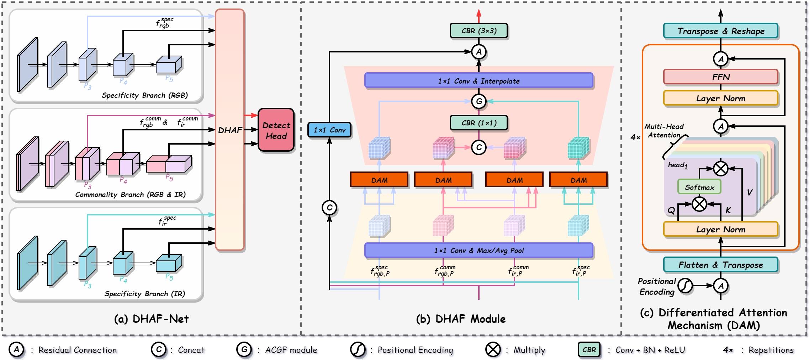

# DDAF-Net

Official PyTorch implementation of “Decoupled and Differentiated Attention Fusion Network for Object Detection”

[Paper]()

🔒 The core implementation folder **`ultralytics/`** will be released after the paper is accepted.

## Abstract

The fusion of data from visible (RGB) and infrared (IR) sensors is essential for robust all-day and all-weather object detection. However, existing methods often suffer from modality redundancy and noise interference. To address these challenges, we propose the Decoupled and Differentiated Attention Fusion Network (DDAF-Net). Architecturally, DDAF-Net employs a decoupled backbone with a Siamese weight-sharing strategy to extract modality-common features, while parallel branches capture modality-specific features. To effectively integrate these features, we design the Differentiated Attention Fusion Module (DAFM). First, we introduce a Spatial Residual Unshuffle Embedding (SRUE) to achieve lossless downsampling while preserving global semantic information. Second, differentiated attention mechanisms are applied for feature enhancement: the Dual-Norm Alignment Attention (DNAA) facilitates effective modal alignment and enhances semantic consistency in modality-common features, while the Sparse Purification Attention (SPA) enables the selective utilization of complementary information by suppressing noise and focusing on salient regions in modality-specific features. Finally, the Adaptive Complementary Fusion Module (ACFM) integrates these components by using modality-common features as a baseline and dynamically weighting the complementary modality-specific information. Extensive experiments on public datasets such as LLVIP and M$^\text{3}$FD demonstrate that DDAF-Net achieves state-of-the-art performance. These results validate the effectiveness of our proposed decoupling-enhancement-fusion paradigm.

## Overview



## Environment Setup

**1. Create a virtual environment**

```bash
conda create -n ddaf python=3.8
conda activate ddaf
```

**2. Install PyTorch**

```bash
conda install pytorch==2.3.1 torchvision==0.18.1 torchaudio==2.3.1 pytorch-cuda=12.1 -c pytorch -c nvidia
# python -m pip install torch==2.3.1+cu121 torchvision==0.18.1+cu121 torchaudio==2.3.1 --extra-index-url https://download.pytorch.org/whl/cu121
```

**3. Install YOLOv8 dependencies**

Copy the ultralytics folder and the pyproject.toml file to your project root directory, then run:

```bash
pip install -e .
```

## Code Modifications

DHAF-Net is implemented based on the Ultralytics YOLOv8 framework with the following modifications:

- Data loading
	- ultralytics.data.base.BaseDataset.get_image_and_label
	- ultralytics.data.utils.img2label_paths
- Model initialization
	- ultralytics.nn.tasks.DetectionModel.\_\_init\_\_
- Custom modules
	- ultralytics/nn/modules/conv.py
	- ultralytics/nn/modules/block.py
- Others…


## Dataset & Weights

Please convert datasets to YOLO format and organize them as follows:

```
FLIR-aligned / LLVIP / M3FD / ...
    │
    ├─imageIR
    │    ├─test
    │    └─train
    ├─imageRGB
    │    ├─test
    │    └─train
    └─labels
         ├─test
         ├─train
         └─classes.txxt
```

⭐ **Dataset & weights download link:** 

- [Baidu drive](https://pan.baidu.com/s/1nGKAO1tFFy76STC1Xo8CLQ?pwd=ddaf)
- [Google drive](https://drive.google.com/drive/folders/1kYFKWIeLFmQTXxxvmQhWh8aIjWEup8G5)

## Training

To start training:

```bash
python train.py
```

You can modify training configurations (dataset path, model architecture, hyperparameters) in the YAML or configuration files.

**Evaluation & Prediction**

```
python validate.py
python predict.py
```

## Results

Please refer to the **`./runs/detect/`** directory for training results.

## Citation

If you find this work useful in your research, please consider citing our paper:

```

```

## Acknowledgements

This project is built upon the excellent [Ultralytics YOLOv8](https://github.com/ultralytics/ultralytics) framework. We gratefully acknowledge their open-source contributions.